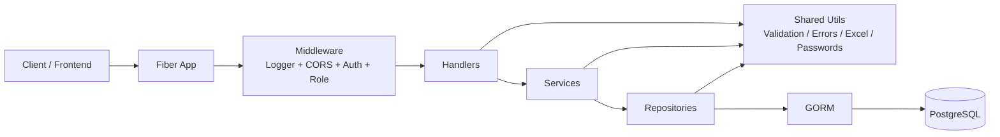
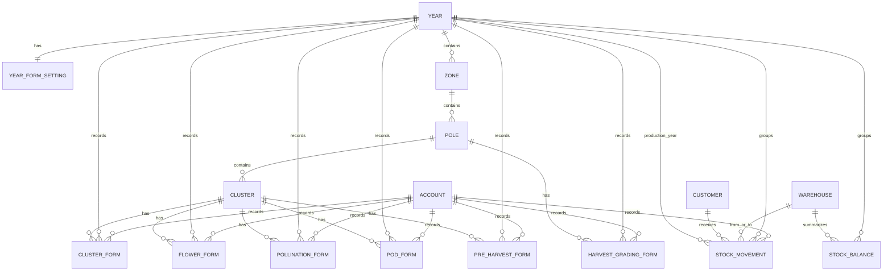
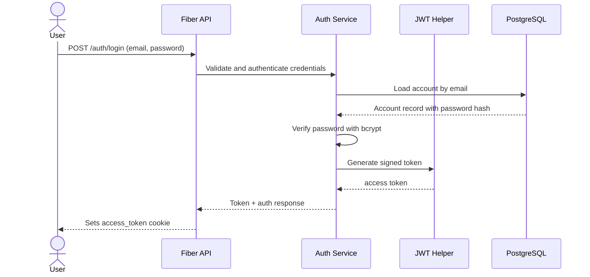
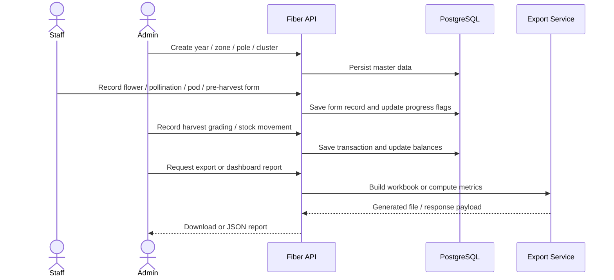

# Project Name

- Project name: `DoiTung-service`
- Short description: A Go backend API for managing Doi Tung production workflow data, including years, zones, poles, clusters, stage-based field forms, harvest grading, warehouses, customers, stock movements, exports, and dashboard analytics.
- Purpose: Provide a centralized API for recording, validating, reporting, and exporting operational data across the production lifecycle.

# Table of Contents

- [Project Name](#project-name)
- [Project Overview](#project-overview)
- [Tech Stack](#tech-stack)
- [System Architecture](#system-architecture)
- [Project Structure](#project-structure)
- [Features](#features)
- [Database Design](#database-design)
- [API Documentation](#api-documentation)
- [Authentication & Authorization](#authentication--authorization)
- [Business Workflow](#business-workflow)
- [Installation](#installation)
- [Environment Variables](#environment-variables)
- [Configuration](#configuration)
- [Running the Project](#running-the-project)
- [Error Handling](#error-handling)
- [Validation](#validation)
- [Security](#security)
- [Code Structure](#code-structure)
- [Development Guide](#development-guide)
- [Future Improvements](#future-improvements)
- [License](#license)

---

# Project Overview

This project is a Fiber-based Go API that manages production master data and stage-based field operations. The code shows workflows for maintaining yearly structures, organizing zones, poles, and clusters, recording stage forms for flower/pollination/pod/pre-harvest/harvest grading, tracking warehouses and customers, recording stock movements, generating Excel exports, and serving dashboard analytics.

The business problem it solves is operational traceability. Instead of keeping production, grading, and stock records in separate tools, the API centralizes the lifecycle so data can be recorded once and then reused for management tables, exports, and performance dashboards.

Main features implemented in the source code include authentication, role-based access control, year and zone management, cluster and pole management, stage form entry, harvest grading, warehouse and customer management, stock movement tracking, Excel export generation, and dashboard metrics.

The intended users are administrators and staff. The route definitions show `ADMIN` and `STAFF` roles, with most management and reporting endpoints restricted to `ADMIN` and the operational endpoints available to authenticated users.

# Tech Stack

| Category | Technologies |
| --- | --- |
| Programming language | Go 1.25.4 |
| Framework | Fiber v2 |
| Database | PostgreSQL 16 (Docker Compose service) |
| ORM | GORM |
| Authentication | JWT (HS256), bcrypt password hashing, cookie-based session token |
| API framework | Fiber v2 |
| Libraries | `go-playground/validator/v10`, `golang-jwt/jwt/v5`, `golang.org/x/crypto/bcrypt`, `joho/godotenv`, `xuri/excelize/v2` |
| Middleware | Fiber logger, Fiber CORS, custom auth middleware, custom role middleware |
| Build tools | Go toolchain, Docker, Docker Compose, Air configuration (`.air.toml`) |
| Package manager | Go modules |

# System Architecture

The project follows a layered monolith pattern.

- Request flow: Client -> Fiber route -> middleware -> handler -> service -> repository -> GORM -> PostgreSQL.
- Cross-cutting concerns: validation, standardized error handling, JWT parsing, role checks, password hashing, and Excel workbook generation.
- Wiring: `cmd/server/main.go` initializes config, connects to the database, auto-migrates models, seeds the default admin account, installs middleware, and registers every module.



Layer responsibilities:

- `handlers` parse input, validate requests, read query parameters, set status codes, and format responses.
- `services` contain business rules and orchestrate repository calls.
- `repositories` perform data access through GORM.
- `models` define the database schema and relationships.
- `middleware` enforces authentication and role permissions.
- `utils` provide reusable helpers for validation, errors, Excel generation, password hashing, and request parsing.

# Project Structure

```text
backend/
├── cmd/
│   └── server/
│       └── main.go
├── internal/
│   ├── common/
│   │   ├── form/
│   │   ├── jwt/
│   │   └── repository/
│   ├── config/
│   ├── middleware/
│   ├── models/
│   ├── modules/
│   │   ├── account/
│   │   ├── auth/
│   │   ├── cluster/
│   │   ├── customer/
│   │   ├── dashboard/
│   │   ├── exportdata/
│   │   ├── forms/
│   │   ├── pole/
│   │   ├── stock/
│   │   ├── warehouse/
│   │   ├── year/
│   │   └── zone/
│   ├── routes/
│   ├── types/
│   └── utils/
├── docker-compose.yml
├── Dockerfile
├── .air.toml
├── .env
├── doc.txt
└── go.mod
```

Major folder purposes:

- `cmd/server/` contains the application entrypoint.
- `internal/config/` contains database connection and seeding logic.
- `internal/common/` contains shared infrastructure helpers, including JWT, generic repository helpers, and custom form validators.
- `internal/middleware/` contains authentication and role-based authorization checks.
- `internal/models/` defines the GORM entities and schema relationships.
- `internal/modules/` contains feature modules. Each module typically has DTOs, handlers, service interfaces and implementations, repository interfaces and implementations, and route registration.
- `internal/routes/` exists as a placeholder; route registration is performed directly in `cmd/server/main.go`.
- `internal/types/` contains shared types such as timestamps and enums.
- `internal/utils/` contains reusable application helpers.
- `tmp/` is the local build output directory used by Air and the build config.

# Features

## Authentication and Accounts

- Login with email and password.
- Logout via cookie clearing.
- Retrieve the current authenticated account.
- Admin-only account creation, listing, profile updates, and password updates.

## Year and Zone Management

- Create years.
- Toggle form availability per year.
- List years and year settings.
- Display year management tables.
- Create zones and rename zones.
- List zones and zone management tables.

## Pole and Cluster Management

- List poles by zone.
- Filter poles for management views.
- Create clusters.
- View cluster forms.
- Update cluster forms.
- View cluster form histories.
- Filter clusters by zone, pole, cluster number, and completion progress.

## Stage Forms

- Flower forms.
- Pollination forms.
- Pod forms.
- Pre-harvest forms.
- Harvest grading forms.

Each stage supports create/update, detail lookup, history lookup, and zone-level listing where implemented.

## Warehouse, Customer, and Stock Management

- Create, update, and list warehouses.
- Create, update, and list customers.
- Record carry-over stock, incoming stock, and issued stock.
- Delete stock movements and reverse their effect on balances.
- Generate warehouse and customer stock summaries.
- Generate stock overview and filter stock history.

## Export and Analytics

- Export cluster forms to XLSX.
- Export harvest grading and harvest grading summaries to XLSX.
- Export stock movements to XLSX.
- Export customer distribution reports to XLSX.
- Serve dashboard analytics for performance, stage condition, and production trends.

# Database Design

The database is defined in GORM models and created automatically with `AutoMigrate` at startup. No separate SQL migration files were found in the repository.

## Tables

| Table | Primary key | Purpose | Relationships |
| --- | --- | --- | --- |
| `accounts` | `account_id` | Users who authenticate and record data | Used by `RecordedByID` in form and stock tables |
| `years` | `year_id` | Production years | Parent of zones and form records |
| `year_form_settings` | `year_id` | Per-year feature toggles | 1:1 with `years` |
| `zones` | `zone_id` | Zone master data | Belongs to `years`; parent of poles |
| `poles` | `pole_id` | Pole master data | Belongs to `zones`; parent of clusters and harvest grading forms |
| `clusters` | `cluster_id` | Cluster master data | Belongs to `poles`; parent of stage forms |
| `cluster_forms` | `cluster_form_id` | Cluster condition records | Belongs to `years`, `clusters`, `accounts` |
| `flower_forms` | `flower_form_id` | Flower stage records | Belongs to `years`, `clusters`, `accounts` |
| `pollination_forms` | `pollination_form_id` | Pollination stage records | Belongs to `years`, `clusters`, `accounts` |
| `pod_forms` | `pod_form_id` | Pod stage records | Belongs to `years`, `clusters`, `accounts` |
| `pre_harvest_forms` | `pre_harvest_form_id` | Pre-harvest stage records | Belongs to `years`, `clusters`, `accounts` |
| `harvest_grading_forms` | `harvest_grading_form_id` | Harvest grading records | Belongs to `years`, `poles`, `accounts` |
| `warehouses` | `warehouse_id` | Warehouse master data | Used by stock movements and stock balances |
| `customers` | `customer_id` | Customer master data | Referenced by issued stock movements |
| `stock_movements` | `stock_movement_id` | Stock transaction records | Belongs to `years`, optional production year, optional warehouses, optional customer, and `accounts` |
| `stock_balances` | `stock_balance_id` | Aggregated stock balance by year, warehouse, and grade | Unique by `year_id`, `warehouse_id`, `grade` |

## Relationships

- A `Year` has many `Zone` records.
- A `Year` has one `YearFormSetting` record with the same primary key.
- A `Zone` has many `Pole` records.
- A `Pole` has many `Cluster` records and many harvest grading records.
- A `Cluster` has many cluster, flower, pollination, pod, and pre-harvest forms.
- A `StockMovement` belongs to a year, optional production year, optional source warehouse, optional target warehouse, optional customer, and the recording account.
- `StockBalance` is a summary table keyed by year, warehouse, and grade.



# API Documentation

## Auth

| Method | URL | Description | Auth | Request parameters | Request body | Response | Status codes |
| --- | --- | --- | --- | --- | --- | --- | --- |
| POST | `/auth/login` | Authenticates a user and sets the `access_token` cookie. | No | None | `LoginRequest` (`email`, `password`) | `AuthResponse` | `200` |
| POST | `/auth/logout` | Clears the `access_token` cookie. | Yes | None | None | `{ message }` | `200` |
| GET | `/auth/me` | Returns the current authenticated user info. | Yes, roles `ADMIN` or `STAFF` | None | None | `UserInfoResponse` | `200` |

## Accounts

| Method | URL | Description | Auth | Request parameters | Request body | Response | Status codes |
| --- | --- | --- | --- | --- | --- | --- | --- |
| POST | `/accounts/create` | Creates a new account. | Yes, `ADMIN` | None | `AccountCreateForm` | `AccountCreateResponse` | `201` |
| PUT | `/accounts/update-info` | Updates account profile fields. | Yes, `ADMIN` | None | `AccountUpdateInfoForm` | `AccountUpdateInfoResponse` | `200` |
| PUT | `/accounts/update-password` | Updates an account password. | Yes, `ADMIN` | None | `AccountPasswordUpdateForm` | `AccountPasswordUpdateResponse` | `200` |
| GET | `/accounts/get-all` | Returns all accounts. | Yes, `ADMIN` | None | None | `AccountLists` | `200` |
| GET | `/accounts/get-by-id?userId=` | Returns one account by ID. | Yes, `ADMIN` | `userId` | None | `AccountDetails` | `200` |
| GET | `/accounts/get-user-account` | Returns the current authenticated account. | Yes | None | None | `AccountDetails` | `200` |

## Years

| Method | URL | Description | Auth | Request parameters | Request body | Response | Status codes |
| --- | --- | --- | --- | --- | --- | --- | --- |
| POST | `/years/create` | Creates a year and its default form-setting record. | Yes, `ADMIN` | None | `YearCreateForm` | `YearCreateResponse` | `201` |
| PUT | `/years/form-setting/update` | Toggles a form active flag for a year. | Yes, `ADMIN` | None | `YearFormSettingStatusChange` | `YearFormSettingStatusChangeResponse` | `200` |
| GET | `/years/get-all-years` | Lists all years. | Yes, `ADMIN` or `STAFF` | None | None | `GetYearResponse` | `200` |
| GET | `/years/get-year-setting?year=` | Returns one year's form settings. | Yes, `ADMIN` or `STAFF` | `year` | None | `YearSettingDetailsResponse` | `200` |
| GET | `/years/get-year-management-table` | Returns year management summary data. | Yes, `ADMIN` | None | None | `YearManagementListResponse` | `200` |
| PATCH | `/years/update-year-name` | Renames a year record. | Yes, `ADMIN` | None | `UpdateYearNameRequest` | `UpdateYearNameResponse` | `200` |

## Zones

| Method | URL | Description | Auth | Request parameters | Request body | Response | Status codes |
| --- | --- | --- | --- | --- | --- | --- | --- |
| POST | `/zones/create` | Creates a zone under a year. | Yes, `ADMIN` | None | `CreateZoneRequest` | `CreateZoneResponse` | `201` |
| GET | `/zones/get-all-zones?year=` | Lists zones for a year. | Yes, `ADMIN` or `STAFF` | `year` | None | `GetAllZoneResponse` | `201` as implemented in code |
| GET | `/zones/get-zone-management-table?year=` | Returns zone management summary data. | Yes, `ADMIN` | `year` | None | `GetZoneManagementTableResponse` | `200` |
| PATCH | `/zones/update-zone-name` | Renames a zone. | Yes, `ADMIN` | None | `UpdateZoneName` | `UpdateZoneNameResponse` | `200` |

## Poles

| Method | URL | Description | Auth | Request parameters | Request body | Response | Status codes |
| --- | --- | --- | --- | --- | --- | --- | --- |
| GET | `/poles/get-by-zone?year=&zoneId=` | Lists poles by year and zone. | Yes | `year`, `zoneId` | None | `PolesByZoneResponse` | `200` |
| GET | `/poles/get-pole-filter?zoneId=&poleNo=&harvestGradingFormDone=` | Filters poles by optional criteria. | Yes | `zoneId`, optional `poleNo`, optional `harvestGradingFormDone` | None | `PoleFilterResponse` | `200` |

## Clusters

| Method | URL | Description | Auth | Request parameters | Request body | Response | Status codes |
| --- | --- | --- | --- | --- | --- | --- | --- |
| POST | `/clusters/create` | Creates a cluster. | Yes | None | `ClusterCreateRequest` | `ClusterCreateResponse` | `201` |
| GET | `/clusters/get-by-zone?year=&zoneId=` | Lists clusters for a zone. | Yes | `year`, `zoneId` | None | `ClustersByZoneResponse` | `200` |
| GET | `/clusters/get-cluster-form?clusterId=` | Returns a cluster form by cluster ID. | Yes | `clusterId` | None | `ClusterFormResponse` | `200` |
| PUT | `/clusters/update-cluster-form` | Updates a cluster form. | Yes | None | `ClusterUpdateRequest` | `ClusterUpdateResponse` | `200` |
| GET | `/clusters/get-cluster-form-histories?year=` | Returns the current user's cluster form history for a year. | Yes | `year` | None | `ClusterFormHistoriesResponse` | `200` |
| GET | `/clusters/get-cluster-forms-by-zone?zoneId=` | Returns all cluster forms for a zone. | Yes, `ADMIN` | `zoneId` | None | `GetAllClustersFormByZoneResponse` | `200` |
| GET | `/clusters/get-cluster-filter?zoneId=&poleNo=&clusterNo=&progressDone=` | Filters clusters by zone, pole, cluster number, and progress. | Yes | `zoneId`, optional `poleNo`, optional `clusterNo`, optional `progressDone` | None | `ClusterFilterResponse` | `200` |

## Flowers

| Method | URL | Description | Auth | Request parameters | Request body | Response | Status codes |
| --- | --- | --- | --- | --- | --- | --- | --- |
| POST | `/flowers/create` | Creates or updates a flower form. | Yes | None | `FlowerFormRequest` | `FlowerFormResponse` | `201` |
| GET | `/flowers/get-flower-form?clusterId=` | Returns flower form details for one cluster. | Yes | `clusterId` | None | `FlowerFormDetails` | `200` |
| GET | `/flowers/get-flower-form-histories?year=` | Returns the current user's flower form history for a year. | Yes | `year` | None | `FlowerFormHistoriesResponse` | `200` |
| PUT | `/flowers/update-flower-form` | Updates a flower form using the same service path as create. | Yes | None | `FlowerFormRequest` | `FlowerFormResponse` | `201` |
| GET | `/flowers/get-flower-forms-by-zone?zoneId=` | Lists flower forms in a zone. | Yes, `ADMIN` | `zoneId` | None | `FlowerFormLists` | `200` |

## Pollinations

| Method | URL | Description | Auth | Request parameters | Request body | Response | Status codes |
| --- | --- | --- | --- | --- | --- | --- | --- |
| POST | `/pollinations/create` | Creates or updates a pollination form. | Yes | None | `PollinationFormRequest` | `PollinationFormResponse` | `201` |
| GET | `/pollinations/get-pollination-form?clusterId=` | Returns pollination form details for one cluster. | Yes | `clusterId` | None | `PollinationFormDetails` | `200` |
| GET | `/pollinations/get-pollination-form-histories?year=` | Returns the current user's pollination history for a year. | Yes | `year` | None | `PollinationFormHistoriesResponse` | `200` |
| PUT | `/pollinations/update-pollination-form` | Updates a pollination form using the same service path as create. | Yes | None | `PollinationFormRequest` | `PollinationFormResponse` | `201` |
| GET | `/pollinations/get-pollination-forms-by-zone?zoneId=` | Lists pollination forms in a zone. | Yes, `ADMIN` | `zoneId` | None | `PollinationFormLists` | `200` |

## Pods

| Method | URL | Description | Auth | Request parameters | Request body | Response | Status codes |
| --- | --- | --- | --- | --- | --- | --- | --- |
| POST | `pods/create` | Creates or updates a pod form. The route group is declared without a leading slash in code. | Yes | None | `PodFormRequest` | `PodFormResponse` | `201` |
| GET | `pods/get-pod-form?clusterId=` | Returns pod form details for one cluster. | Yes | `clusterId` | None | `PodFormDetails` | `200` |
| GET | `pods/get-pod-form-histories?year=` | Returns the current user's pod history for a year. | Yes | `year` | None | `PodFormHistoriesResponse` | `200` |
| PUT | `pods/update-pod-form` | Updates a pod form using the same service path as create. | Yes | None | `PodFormRequest` | `PodFormResponse` | `201` |
| GET | `pods/get-pod-forms-by-zone?zoneId=` | Lists pod forms in a zone. | Yes | `zoneId` | None | `PodFormLists` | `200` |

## Pre-Harvest

| Method | URL | Description | Auth | Request parameters | Request body | Response | Status codes |
| --- | --- | --- | --- | --- | --- | --- | --- |
| POST | `preHarvest/create` | Creates or updates a pre-harvest form. The route group is declared without a leading slash in code. | Yes | None | `PreHarvestFormRequest` | `PreHarvestFormResponse` | `201` |
| GET | `preHarvest/get-preHarvest-form?clusterId=` | Returns pre-harvest form details for one cluster. | Yes | `clusterId` | None | `PreHarvestFormDetails` | `200` |
| GET | `preHarvest/get-preHarvest-form-histories?year=` | Returns the current user's pre-harvest history for a year. | Yes | `year` | None | `PreHarvestFormHistoriesResponse` | `200` |
| PUT | `preHarvest/update-preHarvest-form` | Updates a pre-harvest form using the same service path as create. | Yes | None | `PreHarvestFormRequest` | `PreHarvestFormResponse` | `201` |
| GET | `preHarvest/get-preHarvest-forms-by-zone?zoneId=` | Lists pre-harvest forms in a zone. | Yes | `zoneId` | None | `PreHarvestFormLists` | `200` |

## Harvest Grading

| Method | URL | Description | Auth | Request parameters | Request body | Response | Status codes |
| --- | --- | --- | --- | --- | --- | --- | --- |
| POST | `/harvest-grading/create` | Creates or updates a harvest grading form. | Yes | None | `HarvestGradingFormRequest` | `HarvestGradingFormResponse` | `201` |
| GET | `/harvest-grading/get-harvest-grading-form?poleId=` | Returns harvest grading details for one pole. | Yes | `poleId` | None | `HarvestGradingFormDetails` | `200` |
| GET | `/harvest-grading/get-harvest-grading-form-histories?year=` | Returns the current user's harvest grading history for a year. | Yes | `year` | None | `HarvestGradingFormHistoriesResponse` | `200` |
| PUT | `/harvest-grading/update-harvest-grading-form` | Updates a harvest grading form using the same service path as create. | Yes | None | `HarvestGradingFormRequest` | `HarvestGradingFormResponse` | `201` |
| GET | `/harvest-grading/get-harvest-grading-forms-by-zone?zoneId=` | Lists harvest grading forms in a zone. | Yes, `ADMIN` | `zoneId` | None | `HarvestGradingFormLists` | `200` |

## Warehouses

| Method | URL | Description | Auth | Request parameters | Request body | Response | Status codes |
| --- | --- | --- | --- | --- | --- | --- | --- |
| POST | `/warehouses/create` | Creates a warehouse. | Yes, `ADMIN` | None | `CreateWarehouseRequest` | `CreateWarehouseResponse` | `201` |
| GET | `/warehouses/get-all-warehouses` | Lists all warehouses. | Yes, `ADMIN` | None | None | `GetAllWarehousesResponse` | `200` |
| GET | `/warehouses/get-warehouse-by-id?warehouseId=` | Returns one warehouse by ID. | Yes, `ADMIN` | `warehouseId` | None | `WarehouseDetail` | `200` |
| PUT | `/warehouses/update-warehouse` | Updates a warehouse. | Yes, `ADMIN` | None | `UpdateWarehouseRequest` | `UpdateWarehouseResponse` | `200` |
| GET | `/warehouses/get-warehouse-table-by-year?year=` | Returns warehouse stock totals and remaining balances for a year. | Yes, `ADMIN` | `year` | None | `WarehouseTableByYearResponse` | `200` |

## Customers

| Method | URL | Description | Auth | Request parameters | Request body | Response | Status codes |
| --- | --- | --- | --- | --- | --- | --- | --- |
| POST | `/customers/create` | Creates a customer. | Yes, `ADMIN` | None | `CreateCustomerRequest` | `CreateCustomerResponse` | `201` |
| GET | `/customers/get-all-customers` | Lists customers. | Yes, `ADMIN` | None | None | `AllCustomersResponse` | `200` |
| GET | `/customers/get-customer-by-id?customer_id=` | Returns one customer by ID. | Yes, `ADMIN` | `customer_id` | None | `GetCustomerByIDResponse` | `200` |
| PUT | `/customers/update-customer` | Updates customer data. | Yes, `ADMIN` | None | `UpdateCustomerRequest` | `UpdateCustomerResponse` | `200` |

## Stocks

| Method | URL | Description | Auth | Request parameters | Request body | Response | Status codes |
| --- | --- | --- | --- | --- | --- | --- | --- |
| POST | `/stocks/create-carry-over` | Records carry-over stock and updates balances. | Yes, `ADMIN` | None | `CreateCarryOverStockRequest` | `StockMovementResponse` | `200` |
| POST | `/stocks/create-incoming` | Records incoming stock and updates balances. | Yes, `ADMIN` | None | `CreateIncomingStockRequest` | `StockMovementResponse` | `200` |
| POST | `/stocks/create-issued` | Records issued stock to a customer and updates balances. | Yes, `ADMIN` | None | `CreateIssuedStockRequest` | `StockMovementResponse` | `200` |
| DELETE | `/stocks/delete?stock_movement_id=` | Deletes a stock movement and reverses its balance effect. | Yes, `ADMIN` | `stock_movement_id` | None | `StockMovementResponse` | `200` |
| GET | `/stocks/get-all-by-year?year=` | Lists stock movements for a year. | Yes, `ADMIN` | `year` | None | `GetAllStockMovementsByYearResponse` | `200` |
| GET | `/stocks/get-customer-stock-by-year?year=` | Returns customer stock distribution for a year. | Yes, `ADMIN` | `year` | None | `CustomerStockTableByYearResponse` | `200` |
| GET | `/stocks/get-stock-overview-by-year?year=` | Returns stock overview, grade summary, and monthly summary. | Yes, `ADMIN` | `year` | None | `StockOverviewResponse` | `200` |
| GET | `/stocks/filter-stock?year=&category=&grade=&productionYear=&warehouseId=` | Filters stock history. | Yes, `ADMIN` | `year`, optional `category`, optional `grade`, optional `productionYear`, optional `warehouseId` | None | `GetAllStockMovementsByYearResponse` | `200` |

## Export Data

| Method | URL | Description | Auth | Request parameters | Request body | Response | Status codes |
| --- | --- | --- | --- | --- | --- | --- | --- |
| GET | `/export-data/cluster-forms?year=` | Exports cluster forms as XLSX. | Yes, `ADMIN` | `year` | None | XLSX file download | `200` |
| GET | `/export-data/harvest-grading?year=` | Exports harvest grading as XLSX. | Yes, `ADMIN` | `year` | None | XLSX file download | `200` |
| GET | `/export-data/harvest-grading-summary?year=` | Exports harvest grading summary as XLSX. | Yes, `ADMIN` | `year` | None | XLSX file download | `200` |
| GET | `/export-data/stock-movements?year=` | Exports stock movements for a year as XLSX. | Yes, `ADMIN` | `year` | None | XLSX file download | `200` |
| GET | `/export-data/stock-movements/all` | Exports all stock movements as XLSX. | Yes, `ADMIN` | None | None | XLSX file download | `200` |
| GET | `/export-data/customer-distribution?year=` | Exports customer distribution for a year as XLSX. | Yes, `ADMIN` | `year` | None | XLSX file download | `200` |
| GET | `/export-data/customer-distribution/all` | Exports all customer distribution data as XLSX. | Yes, `ADMIN` | None | None | XLSX file download | `200` |

## Dashboard

| Method | URL | Description | Auth | Request parameters | Request body | Response | Status codes |
| --- | --- | --- | --- | --- | --- | --- | --- |
| GET | `/dashboard/performance-overview?year=` | Returns total flowers, pods, flower loss rate, pod success rate, and harvest totals. | Yes, `ADMIN` | `year` | None | `PerformanceOverviewResponse` | `200` |
| GET | `/dashboard/condition-by-stage?year=` | Returns good/insect/rotten counts per stage. | Yes, `ADMIN` | `year` | None | `ConditionByStageResponse` | `200` |
| GET | `/dashboard/flower-production-trend` | Returns flower production trend data. | Yes, `ADMIN` | None | None | `FlowerProductionTrendResponse` | `200` |
| GET | `/dashboard/pod-production-trend` | Returns pod production trend data. | Yes, `ADMIN` | None | None | `PodProductionTrendResponse` | `200` |
| GET | `/dashboard/pod-set-rate-trend` | Returns pollination set-rate trend data. | Yes, `ADMIN` | None | None | `PodSetRateTrendResponse` | `200` |
| GET | `/dashboard/harvestable-pods-trend` | Returns harvestable pods trend data. | Yes, `ADMIN` | None | None | `HarvestablePodsTrendResponse` | `200` |
| GET | `/dashboard/fresh-pod-grade-trend` | Returns fresh pod grade trend data. | Yes, `ADMIN` | None | None | `FreshPodGradeTrendResponse` | `200` |
| GET | `/dashboard/productive-poles-trend` | Returns productive poles trend data. | Yes, `ADMIN` | None | None | `ProductivePolesTrendResponse` | `200` |
| GET | `/dashboard/weight-per-pod-trend` | Returns average weight per pod trend data. | Yes, `ADMIN` | None | None | `WeightPerPodTrendResponse` | `200` |
| GET | `/dashboard/actual-yield-trend` | Returns actual yield per productive pole trend data. | Yes, `ADMIN` | None | None | `ActualYieldTrendResponse` | `200` |

# Authentication & Authorization

Login uses email and password. The handler validates the JSON payload, the service checks the stored password hash with bcrypt, and a JWT is generated with the account ID and role.

The JWT implementation uses HS256. The secret comes from `JWT_SECRET`; if the variable is missing, the code falls back to `dev-secret`.

The token is stored in the `access_token` cookie. In the login handler, the cookie is set as `HttpOnly`, `SameSite=Lax`, `Secure=false`, `Path=/`, and with a 24-hour max age.

Protected routes use `middleware.RequiredAuth`, which reads the `access_token` cookie, parses the JWT, and stores `account_id` and `role` in Fiber locals. Role-sensitive endpoints additionally use `middleware.RequireRoles`, which only allows the listed roles.

Roles defined in code are `ADMIN` and `STAFF`.

The seeded default admin account is created by `internal/config/seed.go` if it does not already exist. The source seeds `admin@doitung.com` with password `admin123` and role `ADMIN`.



# Business Workflow

The system is centered around a production lifecycle:

1. Administrators create a year and open the relevant forms for that year.
2. Administrators create zones, poles, and clusters.
3. Staff record stage-by-stage field data for clusters and poles.
4. Administrators record harvest grading and stock movements.
5. The API aggregates the data into tables, exports, and dashboard metrics.



# Installation

1. Clone the repository.
2. Create a `.env` file with the database and JWT variables used by the code.
3. Install Go dependencies with `go mod download`.
4. Start PostgreSQL. The repository includes `docker-compose.yml` with a Postgres 16 service and the application service.
5. Build the application with `go build -o ./tmp/main ./cmd/server`.
6. Run the compiled binary with `./tmp/main`.

The repository is also configured for Air using `.air.toml`, which builds the app to `./tmp/main`. The note in `doc.txt` says to add `$(go env GOPATH)/bin` to `PATH` before using Air.

No dedicated migration command or separate migration files were found. Schema creation happens through GORM `AutoMigrate` at startup.

# Environment Variables

| Variable | Description | Required |
| --- | --- | --- |
| `DB_HOST` | Database host used to build the PostgreSQL DSN. | Yes |
| `DB_PORT` | Database port used to build the PostgreSQL DSN. | Yes |
| `DB_USER` | Database username used to build the PostgreSQL DSN. | Yes |
| `DB_PASSWORD` | Database password used to build the PostgreSQL DSN. | Yes |
| `DB_NAME` | Database name used to build the PostgreSQL DSN. | Yes |
| `DB_SSLMODE` | PostgreSQL SSL mode used in the DSN. | Yes |
| `JWT_SECRET` | Secret used to sign and verify JWTs. Falls back to `dev-secret` if unset. | Optional |
| `TZ` | Time zone used by the container and database configuration. | Optional |

# Configuration

## Database Configuration

Database connection logic lives in `internal/config/database.go`.

- The DSN is built from `DB_HOST`, `DB_USER`, `DB_PASSWORD`, `DB_NAME`, `DB_PORT`, and `DB_SSLMODE`.
- The connection uses `TimeZone=Asia/Bangkok`.
- The code retries database connection attempts up to 10 times.
- GORM auto-migrates all models during startup.
- After migration, the application seeds the default admin account if it is missing.

## Server Configuration

The server is created in `cmd/server/main.go`.

- Fiber is initialized with a custom error handler that returns JSON containing the error message.
- Logger middleware is enabled.
- CORS allows `http://localhost:3000` with credentials and the standard JSON/auth headers.
- The server listens on port `8080`.

## JWT Configuration

- JWT logic is implemented in `internal/common/jwt/jwt.service.go`.
- Tokens are signed with HS256.
- Tokens expire after 24 hours.
- The token payload contains `account_id` and `role`.

## Other Configuration Files

- `.air.toml` configures Air to build `./cmd/server` into `./tmp/main`.
- `docker-compose.yml` defines the application and PostgreSQL services.
- `Dockerfile` builds a two-stage image using Go Alpine and runs the compiled binary in Alpine.
- `doc.txt` contains the local note for Air PATH setup.

# Running the Project

## Run Locally

- Install dependencies with `go mod download`.
- Build the binary with `go build -o ./tmp/main ./cmd/server`.
- Run the binary with `./tmp/main`.

## Build

- `go build -o ./tmp/main ./cmd/server`

## Test

- No Go test files or explicit test command were found in the repository.

## Run in Development Mode

- The repository is configured for Air through `.air.toml`.
- The local note in `doc.txt` says to add `$(go env GOPATH)/bin` to `PATH` before using Air.
- Air builds the binary to `./tmp/main`.

## Run in Production Mode

- The `Dockerfile` builds the Go binary in a multi-stage image.
- The `docker-compose.yml` file defines the application container and the PostgreSQL container.

# Error Handling

The project uses a centralized error approach.

- `internal/utils/apperror.go` defines a `RestError` type with HTTP status, message, and optional field errors.
- `utils.HandleError` converts application errors to JSON responses.
- `utils.ParseAndValidate` returns standardized bad request or validation errors when JSON parsing or validation fails.
- `cmd/server/main.go` also defines a custom Fiber error handler for uncaught errors.

The JSON error shape used by the custom helper is:

```json
{
  "success": false,
  "message": "...",
  "errors": []
}
```

# Validation

Validation is handled with `go-playground/validator` through `utils.ParseAndValidate`.

Implemented rules include:

- Required fields for create and update forms.
- Email format validation for login and account creation.
- Minimum lengths for passwords, names, and some text inputs.
- Numeric and positive-value checks for IDs and quantities.
- `oneof` validation for condition and grade enums.
- Custom `excel_sheet_name` validation, which rejects `[]*:/\\?` so zone names can be safely used as Excel sheet names.

Most DTOs use `validate` tags. The customer DTOs use `binding:"required"` tags, and those tags are not enforced by `utils.ParseAndValidate`, which only processes `validator` tags.

# Security

## Authentication

- JWT-based login is used for authenticated requests.
- Tokens are stored in an HttpOnly cookie.
- The auth middleware rejects missing, invalid, or expired tokens.

## Authorization

- Role-based authorization is enforced with `RequireRoles`.
- The code uses `ADMIN` and `STAFF` roles.
- Management and reporting endpoints are generally restricted to `ADMIN`.

## Password Security

- Passwords are hashed with bcrypt before storage.
- Authentication compares the stored hash with the plain password using bcrypt comparison.

## Input Validation

- Request bodies are parsed and validated before service logic runs.
- Query parameters are checked and converted explicitly in handlers.

## SQL Injection Prevention

- Data access uses GORM and parameterized queries through the ORM layer.
- There is no raw SQL file in the repository.

## CORS

- CORS is configured in `main.go`.
- Allowed origin is `http://localhost:3000`.
- Credentials are enabled.
- Headers and methods are explicitly whitelisted.

## Notable Security Caveat

- The repository seeds a default admin account with a known password if the account does not already exist. That is convenient for local setup, but it should be changed before any real deployment.

# Code Structure

The codebase is organized by domain module and cross-cutting infrastructure.

- `cmd/server/main.go` wires the application together.
- `internal/config/` handles database lifecycle and seeding.
- `internal/models/` defines the schema.
- `internal/modules/<feature>/` contains the feature-specific API, service, and repository layers.
- `internal/common/` contains shared abstractions used across modules.
- `internal/utils/` contains reusable helpers for responses, validation, encryption, Excel generation, and calculations.

Most modules follow the same pattern:

1. DTOs define request and response shapes.
2. Handlers parse and validate input, then call services.
3. Services implement the business rules.
4. Repositories query or mutate the database.

The repository also includes a generic CRUD helper in `internal/common/repository/crud.go`, but the module implementations still follow their own repository methods.

# Development Guide

## Add a New API Endpoint

1. Add or update the request and response DTOs in the relevant module.
2. Add the handler method in the module handler file.
3. Add the service interface method and implementation.
4. Add the repository method if data access is required.
5. Register the route in the module route file.
6. Mount the module in `cmd/server/main.go` if it is a new module.

## Add a New Model

1. Add the GORM struct to `internal/models/model.go`.
2. Add any needed enum or shared type under `internal/types/`.
3. Include the model in `internal/config/database.go` auto-migration.
4. Update services and repositories that should use the new table.

## Add a New Service

1. Define the service interface in the module.
2. Implement the behavior in the service implementation file.
3. Keep business rules in the service layer rather than in handlers or repositories.

## Add a New Repository

1. Define the repository interface in the module.
2. Implement the repository against GORM.
3. Use the repository from the service layer only.

## Add a New Middleware

1. Create the middleware under `internal/middleware/`.
2. Apply it in the route registration file.
3. If it depends on auth claims, make sure the auth middleware runs first.

## Add a New Module

1. Create a new folder under `internal/modules/`.
2. Add DTO, handler, service, repository, and route files.
3. Register the module in `cmd/server/main.go`.
4. Add any required models to `internal/models/model.go` and auto-migration.

# Future Improvements

Based on the current codebase, the most obvious improvements are:

- Add Go test coverage for handlers, services, repositories, and validation helpers.
- Unify route registration so `internal/routes/register_routes.go` is actually used.
- Fix the route-group naming inconsistencies for `pods` and `preHarvest`.
- Standardize validation tags so all DTOs use the same validator style.
- Replace the seeded default admin password before production use.
- Introduce explicit migration files instead of relying only on startup auto-migration.
- Review the cookie configuration so login and logout settings are consistent across local and HTTPS deployments.
- Clean up file naming typos such as the dashboard repository files and `preHarvest.repository.Impl.go`.

# License

No license file was found in the repository.